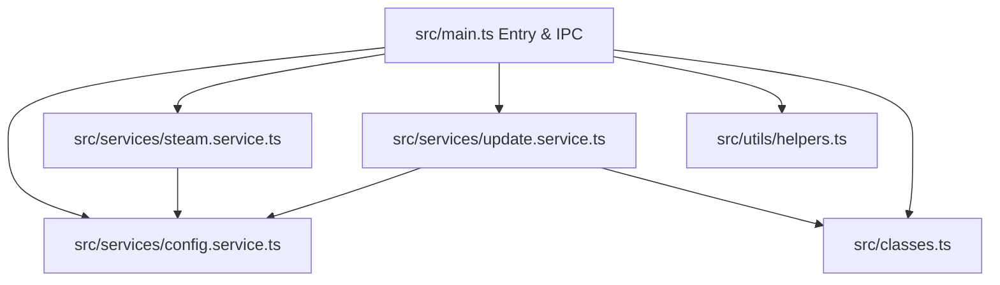

# Architecture & Process Decomposition

This document describes the architectural layout of the SteamLauncher main process after the modular decomposition refactoring implemented in version 1.6.0.

---

## 1. Overview

The main process has been refactored from a monolithic entry point (`src/main.ts`) into a lightweight event coordinator and a set of service‑oriented, modular components. This breakdown adheres to the Single Responsibility Principle, reduces code duplication, and enhances testability.

---

## 2. Core Modules & Services

### 2.1. Main Coordinator ([src/main.ts](file:///home/oliverzein/Dokumente/Daten/Development/Electron/SteamLauncher/src/main.ts))
- **Role**: Entry point for Electron. Handles window lifecycles, tray creation, global shortcut registry, and maps Electron IPC endpoints directly to underlying services.
- **Lines of Code**: Reduced from **1,417 lines** to **~595 lines** (~58% reduction).

### 2.2. Configuration Service ([src/services/config.service.ts](file:///home/oliverzein/Dokumente/Daten/Development/Electron/SteamLauncher/src/services/config.service.ts))
- **Role**: Manages the application configuration lifecycle (loading from/saving to disk), sorts visible games, handles custom game order persistence, and tracks game re-indexing.
- **State**: Encapsulates `private config: Config`.

### 2.3. Steam Service ([src/services/steam.service.ts](file:///home/oliverzein/Dokumente/Daten/Development/Electron/SteamLauncher/src/services/steam.service.ts))
- **Role**: Manages Steam client state checks, queries local ACF appmanifests (`getLocalBuildID`), resolves remote build info via Web API or `steamcmd` cli fallback (`getRemoteBuildID`), checks for game updates, triggers background updates, and manages screen resolution adjustments on game launch.

### 2.4. Update Service ([src/services/update.service.ts](file:///home/oliverzein/Dokumente/Daten/Development/Electron/SteamLauncher/src/services/update.service.ts))
- **Role**: Directs interactive game updates using `steamcmd`. Orchestrates downloading/validation progress parsing, 2FA prompt challenges (relaying Steam Guard codes via stdin), cancellation signals, and isolated manifest synchronization to prevent library corruption.
- **State**: Encapsulates a map of active update sessions.

### 2.5. Shell Utilities ([src/utils/helpers.ts](file:///home/oliverzein/Dokumente/Daten/Development/Electron/SteamLauncher/src/utils/helpers.ts))
- **Role**: Contains stateless low-level shell utilities like process verification (`buildPgrepCmd`), Vite dev-server watchers (`waitForDevServer`), spawn executions, and assets paths resolution.

### 2.6. Shared Classes & Keytar Loader ([src/classes.ts](file:///home/oliverzein/Dokumente/Daten/Development/Electron/SteamLauncher/src/classes.ts))
- **Role**: Defines shared structures (`SteamStarter`, `Game`). Exports a unified `loadKeytar` helper that gracefully resolves native binary fallbacks for both production (asar unpacked paths) and development, lowering code duplication.

---

## 3. Benefits & Improvements

1. **Improved Code Health**: Static analysis issues dropped to 0, maintainability score improved, and churn hotspots in `src/main.ts` were mitigated.
2. **Eliminated Code Duplication**: Code duplication dropped from **7.12%** to **3.36%** by extracting the duplicate keytar loaders into a shared function.
3. **Robust IPC Layer**: All handlers incorporate stringent type checking, input bounds validation, and clear error responses to prevent app crashes.
